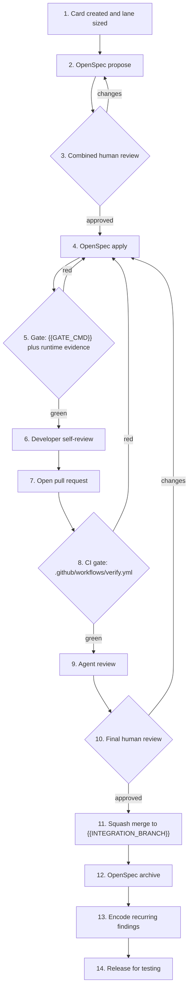

# Standard AI-Assisted Development Workflow

Every change follows this process from card to release. It runs on **OpenSpec + the active coding
agent**. The design goals are spec before code, effort sized to the change, a hard automated gate
before merge, and stable workflow semantics across Claude Code and Codex.

> Generated by the ASMT workflow initializer. Project-specific values (gate command, branches,
> and card tool) were filled at initialization; rerun the initializer when those values change.

## Invocation map

Use the command native to the active host. The workflow action and resulting OpenSpec artifacts
are the same.

| Action | Claude Code | Codex |
| :-- | :-- | :-- |
| Initialize ASMT | `/asmt:workflow-init` | `$asmt:workflow-init` |
| Choose a lane | `/asmt:lanes` | `$asmt:lanes` |
| Explore a change | `/opsx:explore` | `$openspec-explore` |
| Propose a change | `/opsx:propose` | `$openspec-propose` |
| Apply a change | `/opsx:apply` | `$openspec-apply-change` |
| Sync specifications | `/opsx:sync` | `$openspec-sync-specs` |
| Archive a change | `/opsx:archive` | `$openspec-archive-change` |
| Update change artifacts | `/opsx:update` | `$openspec-update-change` |
| Agent review | `/code-review` | `/review` |

The OpenSpec CLI remains a portable fallback for lifecycle operations, including
`openspec archive <change-id>`.

## Project settings

| Setting | Value |
| :-- | :-- |
| Verification gate | `{{GATE_CMD}}` |
| Integration branch | `{{INTEGRATION_BRANCH}}` |
| Release branch | `{{RELEASE_BRANCH}}` |
| Card tool | {{CARD_TOOL}} |

## Three lanes

Declare the lane on the card at creation. Any reviewer can move a mislabeled card to a stricter
lane.

| Lane | Use when | Skips |
| :-- | :-- | :-- |
| **Fast** | Docs, config, dependencies, and small fixes with **no spec delta** | Spec, plan, model review |
| **Standard** (default) | One capability or spec area; the design is obvious | Separate plan review (folded into one review) |
| **Deep** | New subsystem, cross-cutting, or guardrail-adjacent change | Nothing; use the full flow |

## Standard lane

## Step-by-step

| # | Step | Owner | Tool | Output |
| :-- | :-- | :-- | :-- | :-- |
| 1 | **Card created + lane** | PM / card creator | {{CARD_TOOL}} | Card + acceptance + lane |
| 2 | **Propose** | Developer | OpenSpec propose | Proposal + design + spec + tasks |
| 3 | **Combined review** | Card creator | Read the packet | Approved change |
| 4 | **Implement** | Developer | OpenSpec apply | Code + tests |
| 5 | **Gate (local)** | Developer | `{{GATE_CMD}}` + runtime verification | Green gate + evidence |
| 6 | **Developer self-review** | Developer | Active host's review command | Fixes applied |
| 7 | **Open PR** | Developer | Git hosting workflow | PR referencing the change |
| 8 | **CI gate** | CI | `.github/workflows/verify.yml` | Green checks (enforcement) |
| 9 | **Agent review** | Automated | Active host's review command | Review comments |
| 10 | **Final review** | Senior engineer | Human review | Approval |
| 11 | **Merge** | Developer | Squash to `{{INTEGRATION_BRANCH}}` | Merged change |
| 12 | **Archive** | Developer / automation | OpenSpec archive | Delta folded into living specs |
| 13 | **Feedback** | Developer / SSE | OpenSpec rules and durable guidance | Recurring findings encoded |
| 14 | **Release for testing** | QA | Staging deployment | Tested build |

The Fast lane runs implement, gate, self-review, PR, CI gate, final review, and merge. It skips the
proposal and agent-review steps but never skips verification. The Deep lane adds a separate design
review after proposal approval and before implementation.

## Hard verification gate

The verification gate is `{{GATE_CMD}}`. It runs in two places:

1. **Locally before the PR:** Run the gate and, for a change with a runtime surface, drive the
   affected flow and capture evidence that it works.
2. **In CI on the PR:** `.github/workflows/verify.yml` is the enforcement copy. No PR merges red.

## Archive on merge

After merge, archive the change through the active host's OpenSpec archive invocation or
`openspec archive <change-id>`. Archiving folds the delta into `openspec/specs/` and moves the
change to `openspec/changes/archive/`. A merged but unarchived change is a workflow defect because
the living specs are the source of truth.

## Feedback loop

When final human review catches something the spec or agent review should have caught, encode it in
`openspec/config.yaml` (or the repository's existing `openspec/config.yml`), the ASMT block in
`CLAUDE.md` or `AGENTS.md`, or an appropriate review skill. Do not repeatedly rediscover the same
finding in pull requests.

## Agent and model choice

The workflow is independent of the active coding host and model backend. Teams may route
high-volume implementation and self-review to a lower-cost model and reserve stronger judgment for
review gates. Confirm written retention, training, and residency terms before sending proprietary
source through any third-party backend.

## Security

- Never send client or production data through an agent; work with source code and synthetic test
  data only.
- Claude Code deep-merges sensitive-file deny rules into `.claude/settings.json`.
- Codex can use the `asmt-workspace` profile in `.codex/config.toml`. Treat it as enforced only
  after Codex successfully loads the trusted project config and shows the profile in `/permissions`.
- Reference secrets by environment-variable name and resolve them outside prompts; never inline
  secret values.
