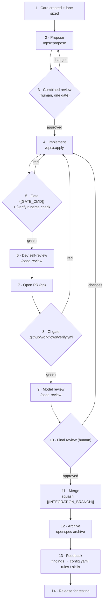

# Standard AI-Assisted Development Workflow

Every change follows this process, from card to release. It runs on **OpenSpec + Claude Code**.
Design goals: **spec before code**, **effort sized to the change**, **a hard automated gate
before merge**, and **model-agnostic** so the team isn't locked to one provider.

> Generated by the `spec-lane-workflow` plugin. Project-specific values (gate command, branches,
> card tool) were filled at init; edit them here if the stack changes.

## Three lanes

Declared on the card at creation. Any reviewer can bump a mislabeled card up a lane.

| Lane                   | Use when                                                   | Skips                                         |
| :--------------------- | :--------------------------------------------------------- | :-------------------------------------------- |
| **Fast**               | Docs, config, deps, small fixes with **no spec delta**     | Spec, plan, model review                      |
| **Standard** (default) | One capability / spec area; the design is obvious          | Separate plan review (folded into one review) |
| **Deep**               | New subsystem, cross-cutting, or guardrail-adjacent change | Nothing — full flow                           |

## Standard lane (the default)

## Step-by-step (Standard lane)

| #   | Step                    | Owner             | Tool                                | Output                          |
| :-- | :---------------------- | :---------------- | :---------------------------------- | :------------------------------ |
| 1   | **Card created + lane** | PM / card creator | {{CARD_TOOL}}                       | Card + acceptance + lane        |
| 2   | **Propose**             | Developer         | `/opsx:propose`                     | proposal + design + spec + tasks|
| 3   | **Combined review**     | Card creator      | read the packet                     | approved change                 |
| 4   | **Implement**           | Developer         | `/opsx:apply`                       | code + tests                    |
| 5   | **Gate (local)**        | Developer         | `{{GATE_CMD}}` + `/verify`          | green + runtime evidence        |
| 6   | **Dev self-review**     | Developer         | `/code-review`                      | fixes applied                   |
| 7   | **Open PR**             | Developer         | `gh`                                | PR referencing the change       |
| 8   | **CI gate**             | CI                | `.github/workflows/verify.yml`      | green checks (enforcement)      |
| 9   | **Model review**        | automated         | `/code-review`                      | review comments                 |
| 10  | **Final review**        | Senior engineer   | human                               | approval                        |
| 11  | **Merge**               | Developer         | squash → `{{INTEGRATION_BRANCH}}`   | merged change                   |
| 12  | **Archive**             | Developer / auto  | `openspec archive <id>`             | delta folded into living specs  |
| 13  | **Feedback**            | Developer / SSE   | `openspec/config.yaml` / skills     | recurring findings encoded      |
| 14  | **Release for testing** | QA                | staging deploy                      | tested build                    |

**Fast lane** runs 4 → 5 → 6 → 7 → 8 → 10 → 11 (no propose/review, no model review; still gated).
**Deep lane** adds a separate design review between steps 2 and 4.

## The gate runs in two places

The verification gate is `{{GATE_CMD}}`. It runs:

1. **Locally, pre-PR** (step 5) — fast feedback, plus a `/verify` runtime check for any change
   with a runtime surface (drive the affected flow, not just tests — evidence over claims).
2. **In CI, on the PR** (step 8) — the **enforcement** copy. **No PR merges red.** Non-negotiable.

## Archive on merge (living specs)

Merging a change **must** be followed by `openspec archive <change-id>`, which folds the delta
into `openspec/specs/` and moves the change to `openspec/changes/archive/`. A merged-but-unarchived
change is a bug — the living specs are the source of truth.

## Feedback loop (the harness learns)

If final human review catches something the spec or model review **should** have caught, encode it:
a `rules:` entry in `openspec/config.yaml`, a line in `CLAUDE.md`, or a check in a project
`/code-review` skill. Don't re-litigate the same finding in PR comments.

## Model backend

One tool — **Claude Code** — pointed at a model backend per step via API base-URL + key. The
workflow is identical regardless of backend; this is the anti-lock-in lever. Route high-volume
steps (implement, self-review) to a cheaper model and the judgment gate (model review) to a
stronger one. Before routing proprietary source through any third-party backend, confirm written
zero-retention / no-training terms and data residency.

## Security

- **Never send client / production data through an agent** — source code only, every backend.
- **Sensitive files blocked at the tool level** — `.claude/settings.json` denies reading `.env*`,
  `*.pem`, `*.key`, `*.p12`, `*.pfx`, `secrets/`, `*.local`, before any model sees them.
- Secrets are referenced by env-var name and resolved server-side, never inlined.